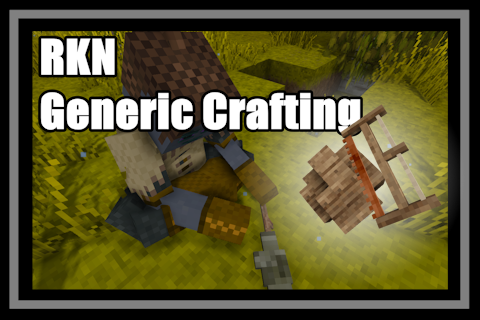

# RKN Generic Crafting

Generic crafting system that completely replaces the UI grid with a more immersive mechanic.



This mod does not introduce any new *recipe-specific* crafting mechanics.
The intention of this mod is instead to create a *generic* crafting system that can work for any and all grid recipes, out of the box.

## Instructions

#### Add ingredients

Right click with any non-tool item or block on a solid surface, while holding the crafting button (ALT, rebindable), to create a crafting surface.
Right click with additional items or blocks to add more ingredients.

#### Recipe matching

If the ingredients and tools matches a recipe, it will appear in the top info bar while looking at the crafting surface.
If there are more than one available recipe, then you can switch between them by holding crafting button and right clicking.

Recipe matching is based on perspective. Lets say we want to craft Crude Ladder. So you add the sticks (S) as such:

```
         NORTH
     |---|---|---|
     | S |   | S |
     |---|---|---|
WEST | S | S | S | EAST
     |---|---|---|
     | S |   | S |
     |---|---|---|
         SOUTH
```

In this case, the crafting surface will only allow you to craft crude ladder if you look at it from north or south.

#### Crafting

Hold right click to start crafting. Once crafting has completed the recipe output will spawn and the ingredients will be consumed.
If a recipe requires tools, then these must be held in your hands while trying to craft. If a recipe requires two tools then the second one must be held in offhand slot.

If there are enough remaining ingredients to continue crafting, then continuing to hold rick click will continue crafting at a slightly faster pace.

#### Multi-stage crafting

In case a recipe requires more tools than can be held at one time, you can start crafting with any of the required tools. 
Instead of producing the recipe output, it will instead produce an Unfinished Craft item. 
This item can be placed on a new crafting surface where you can then proceed to use one or more of the remaining tool requirements in the recipe.
Only once all required tool has been used will it produce the final recipe output.

Clicking the handbook hotkey on an Unfinished Craft itemslot will open the handbook page for the recipe output. 
Combining this with list of used tools in the itemslot hover description, allows you to see what tools remains to be used.  

#### Other

* The crafting surface can de destroyed to reclaim ingredients.
* In order to not functions as a hyper-efficient ground storage, any crafting surface will auto delete itself after 2 minutes of inactivity (configurable).

<!--  -->
<!--  -->

### Crafting speed

The time it takes to craft is measured as `baseCraftingTimeSeconds * craftingSurfaceTimeModifier * recipeCraftingTimeModifier * Max(ConsecutiveCraftingTimeModifierMin, ConsecutiveCraftingTimeModifier^(amount))`.

Where `baseCraftingTimeSeconds` is configurable, `craftingSurfaceTimeModifier` depends on what block is under the crafting surface, `recipeCraftingTimeModifier` depends on the recipe, and `consecutiveModifer` decreases after each consecutive crafting (with minimnum cap).

As an example for `craftingSurfaceTimeModifier`: tables provides the fastest crafting speed, while cobble stone is a bit slower, and soil is the slowest.

For `recipeCraftingTimeModifier` the only recipes currently that modifies this are tool and weapon recipes.

### Adjusted recipes

* Plank blocks, slabs, and stairs now requires hammer. Just because I wanted more recipes to have tool requirements now that it plays animations. Though I disabled durability cost at least.

## Config

File: `%AppData%/Roaming/VintagestoryData/ModConfig/rkncrafting.json`

| Key   | Default | Description                                                                                                                                                                                                                                                  | Authorative side |
|-------|---------|--------------------------------------------------------------------------------------------------------------------------------------------------------------------------------------------------------------------------------------------------------------|-------------------|
| `BaseCraftingTimeSeconds` | 1.0 | Base seconds to craft.                                                                                                                                                                                                                                       | Server |
| `AutoDeleteTimeSeconds` | 120 | How many seconds of inactivity it takes for crafting surface to self-delete.                                                                                                                                                                                 | Server |
| `ConsecutiveCraftingTimeModifier` | 0.95 | Amount to decrease time to craft while continuing to hold right click.                                                                                                                                                                                       | Server |
| `ConsecutiveCraftingTimeModifierMin` | 0.5 | The minimum amount that crafting time can be decreased during consecutive crafting.                                                                                                                                                                          | Server |
| `EnableBulkCrafting` | false | Allows for holding SHIFT while crafting to craft as many items as possible at once.                                                                                                                                                                          | Server |
| `BulkBaseCraftingTimeSeconds` | 2.0 | Base seconds to craft if using bulk crafting.                                                                                                                                                                                                                | Server |
| `DisableUICraftingGrid` | true | Disables the inventory UI crafting grid.                                                                                                                                                                                                                     | Client |
| `EnableGridless` | false | Crafting surfaces no longer have grid. Recipe matching will not care about what slot ingredients are in.                                                                                                                                                     | Server |
| `PauseInteractPostCraftSeconds` | 2.0 | Block all right click interactions after crafting finished for this amount of seconds. This is to prevent unintentional actions right after crafting has ended when you are still holding right click. Releasing right click will also unblock interactions. | Client |

## Required dependencies

* [JSON Patches lib](https://mods.vintagestory.at/jsonpatcheslib)

## Compatibility

Fully safe to add to existing save. It is recommended that all crafting surfaces are deleted before removing from existing save. Though given the auto-delete feature this should be trivial.

Unfinished crafting items may break after game update or installing/updating mods that add grid recipes. It is recommended that these are only temporary.

Any mod that disables grid recipes will also disable for this mod.

[Immersive Inventory Slots](https://mods.vintagestory.at/show/mod/59074) and this mod will override each other's UI changes if playing with DisableUICraftingGrid=true. To hide the grid again you must use HideCraftingGrid in that mod's config.

### Compatibility tips for other modders

Use `craftingIngredientTransform` attribute to change how collectibles are rendered on crafting surfaces.
This is also available in the `.tfedit` UI.
By default the mod will auto-scale ingredients to fit the slot, but sometimes this does not work right.

Blocks must have the `rkncrafting.spawncraftingsurface` behavior in order to be able to spawn crafting surface on top.
The behavior can have the property `craftingTimeModifier` to change how fast crafting is on it.

Recipes can have the attribute `craftingTimeModifier` to edit how fast it is to craft.

## Wishlist

* More and better animations based on tools and recipe
* Particles while crafting
	* Estimated difficulty: MEDIUM
* Particles per item type
	* Estimated difficulty: MEDIUM-HARD (though can be done one recipe at a time)
* Sounds while crafting
	* Estimated difficulty: MEDIUM
* Sounds per item type
	* Estimated difficulty: MEDIUM-HARD (though can be done one recipe at a time)
* Support adding ingredient while in mouse mode
	* Estimated difficulty: MEDIUM

## Known issues

* Existing unfinished crafting items may break after updating game or installing/updating mods. This is due to their reference to recipe that is not so resilient. It should not crash the game. Just makes you unable to complete the craft or recover the ingredients. In rare cases it may allow you to craft, but the output is different. Unsure if this is possible to fix without proper recipe ids.

## Major release changelog

* 0.3.0: Support multi-stage crafting for recipes with tool requirements that can not be held in one go. Move recipe selection hotkey to F (Tool mode selection). Support adding tool as ingredient, for mod recipes that consumes tools as simple ingredients. Add handbook guide.
* 0.2.0: Added grid to crafting surface. Added new recipe selection UI. Recipes are now scanned on client instead of server. Tools are no longer ignored during recipe scan. Ability to take back ingredients.
* 0.1.0: Initial pre-release
